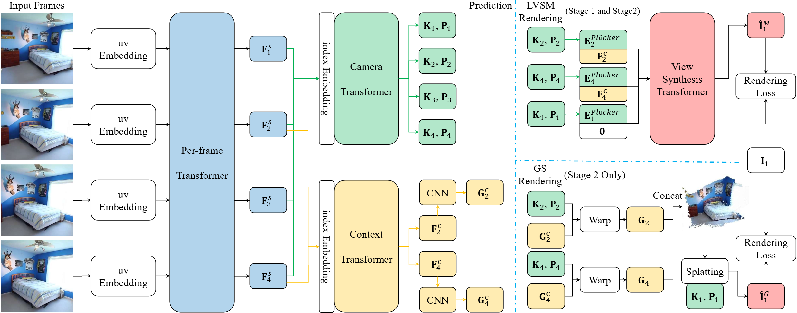

# Pensieve

**This is an experimental repository. Its code may change in the near future.**

The official PyTorch implementation for the paper
> **Recollection from Pensieve: Novel View Synthesis via Learning from Uncalibrated Videos**
>\
>Ruoyu Wang, Yi Ma, Shenghua Gao
> \
> [Arxiv](https://arxiv.org/abs/2505.13440)

<p align="center">
  
</p>

## 🐁 Setup
We recommend using anaconda to create the env and install the requirements by running: (Please modify `pytorch-cuda` according to your CUDA version.)
```shell
conda create -n pensieve python=3.11 -y
conda activate pensieve
conda install pytorch==2.4.1 torchvision==0.19.1 torchaudio==2.4.1 pytorch-cuda=12.4 -c pytorch -c nvidia
pip install -r requirements.txt
```
You also need to install the official [2DGS](https://github.com/hbb1/diff-surfel-rasterization). We sincerely appreciate the authors for their excellent work, which natively supports the optimization of both intrinsics and extrinsics.
We have also implemented versions based on the original [3DGS](https://github.com/graphdeco-inria/diff-gaussian-rasterization) and [gsplat](https://github.com/nerfstudio-project/gsplat), but they are not required—you can comment out the related imports to skip their installation.

## 🐂 Datasets
Please use dataset.params.data_path=/path/to/data to specify the data path.
### RealEstate10K
We use the chunked RealEstate10K provided by [PixelSplat](https://github.com/dcharatan/pixelsplat). We greatly appreciate their efforts in processing and sharing the data. Please refer to their repository for instructions on getting the data.

### DL3DV
Please refer to [DL3DV-10K](https://github.com/DL3DV-10K/Dataset) for training data, and to [DL3DV-Benchmark](https://huggingface.co/datasets/DL3DV/DL3DV-Benchmark) for evaluation.

The evaluation data needs to be converted using the scripts provided by [DepthSplat](https://github.com/cvg/depthsplat/blob/main/DATASETS.md).

## 🐅 Training
We provide the defult pretraining config in configs/base_config.yaml.
You can train the model by running:
```shell
accelerate launch --num_processes 8 --num_machines 1 --machine_rank 0 train.py -c ./configs/base_config.yaml
```

To perform alignment, you can use the following command:
```shell
accelerate launch --num_processes 8 --num_machines 1 --machine_rank 0 train.py -c ./configs/align_config.yaml
```

To reload the weights and train on the DL3DV-10K dataset, you can use the following command:
```shell
accelerate launch --num_processes 8 --num_machines 1 --machine_rank 0 train.py -c ./configs/dl3dv_config.yaml
```

You can freely set `num_processes` and `num_machines`, but please carefully adjust the iteration-related settings in the config. For example, `dataset.params.warmup_steps` and `losses.depth_sample_loss.params.max_step`.

## 🐇 Evaluation
During evaluation, you only need to set the `base_config` in the evaluation config file to point to the config saved in the experiment folder. It will then configure the network accordingly and load the weights from that folder.

We have provided example config files. You can evaluate the model by running:

```shell
accelerate launch --num_processes 8 --num_machines 1 --machine_rank 0 train.py -c ./configs/re10k_evaluation.yaml
```
The `tgt_pose=[predict|align]` parameter in the `evaluations.RefineEvaluation` class corresponds to **Target-aware Evaluation** and **Target-aligned Evaluation**, as described in the paper.


## 🐉 Pretrained model
We have provided the pretrained model for RealEstate10K and DL3DV-10K. You can download them from [huggingface](https://huggingface.co/dwawayu/pensieve/tree/main).

